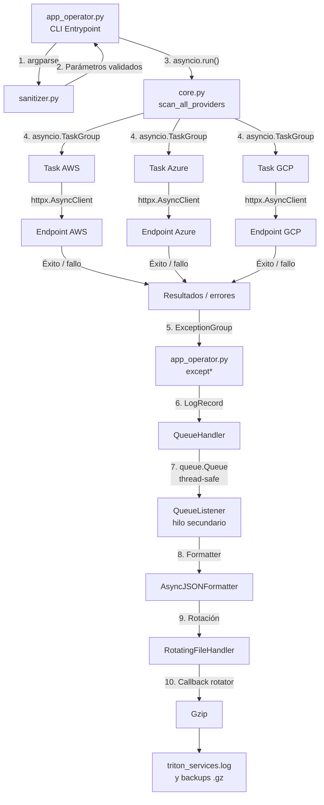

# TritonMonitor

Monitor CLI asíncrono de telemetría para **Triton Cloud Services**.

El proyecto implementa consultas HTTP concurrentes mediante `asyncio`, `httpx.AsyncClient` y `asyncio.TaskGroup`, junto con un sistema de observabilidad basado en `QueueHandler`, `QueueListener`, JSON estructurado, rotación de archivos y compresión Gzip.

La solución está diseñada para tolerar fallos simultáneos de red sin provocar un cierre abrupto de la aplicación. Los errores concurrentes se agrupan mediante `ExceptionGroup` y se procesan selectivamente utilizando `except*`.

---

## 1. Requisitos

* Python 3.11 o superior.
* Conexión a Internet para los escenarios que consumen servicios públicos.
* `httpx>=0.27.0`.

El proyecto fue desarrollado y probado con Python 3.13 y `httpx 0.28.1`.

---

## 2. Estructura del proyecto

```text
triton_monitor/
├── .venv/
├── src/
│   ├── triton_telemetry/
│   │   ├── __init__.py
│   │   ├── exceptions.py
│   │   ├── sanitizer.py
│   │   ├── core.py
│   │   └── logging_engine.py
│   └── app_operator.py
├── tests/
│   ├── test_chaos.py
│   └── validate_logs.py
├── logs/
├── pyproject.toml
├── requirements.txt
└── README.md
```

### Responsabilidad de cada módulo

| Archivo             | Responsabilidad                                                                         |
| ------------------- | --------------------------------------------------------------------------------------- |
| `exceptions.py`     | Define las excepciones semánticas propias del dominio.                                  |
| `sanitizer.py`      | Valida argumentos CLI mediante `argparse`, expresiones regulares y `ArgumentTypeError`. |
| `core.py`           | Ejecuta las consultas HTTP asíncronas y coordina las tareas mediante `TaskGroup`.       |
| `logging_engine.py` | Implementa JSON estructurado, `QueueHandler`, `QueueListener`, rotación y Gzip.         |
| `app_operator.py`   | Punto de entrada CLI y captura quirúrgica mediante `except*`.                           |
| `test_chaos.py`     | Pruebas automatizadas de resiliencia.                                                   |
| `validate_logs.py`  | Validador forense de JSON y archivos Gzip.                                              |

---

## 3. Instalación

Crear y activar el entorno virtual:

### Windows CMD

```cmd
python -m venv .venv
.venv\Scripts\activate
```

### PowerShell

```powershell
python -m venv .venv
.venv\Scripts\Activate.ps1
```

Instalar las dependencias:

```cmd
python -m pip install -r requirements.txt
```

Instalar el proyecto en modo editable:

```cmd
python -m pip install -e .
```

Verificar la versión de `httpx`:

```cmd
python -m pip show httpx
```

---

## 4. Arquitectura

El flujo general del sistema es:

```text
CLI
  │
  ▼
argparse / sanitizer.py
  │
  ▼
asyncio.run()
  │
  ▼
scan_all_providers()
  │
  ▼
asyncio.TaskGroup
  ├──────────────┬──────────────┐
  ▼              ▼              ▼
 AWS            Azure           GCP
  │              │              │
  ▼              ▼              ▼
httpx           httpx          httpx
  │              │              │
  └──────────────┴──────────────┘
                 │
                 ▼
          resultados / errores
                 │
                 ▼
          ExceptionGroup
                 │
                 ▼
              except*
                 │
                 ▼
           logging_engine
                 │
                 ▼
           QueueHandler
                 │
                 ▼
             queue.Queue
                 │
                 ▼
          QueueListener
                 │
                 ▼
       RotatingFileHandler
                 │
          ┌──────┴──────┐
          ▼             ▼
       JSON log       rollover
                          │
                          ▼
                         Gzip
```

---

## 5. Diagrama Mermaid de flujo de hilos



El event loop de `asyncio` ejecuta las consultas HTTP concurrentemente. La escritura física del archivo queda delegada al `QueueListener`, evitando que el handler de disco forme parte del camino de ejecución de las tareas de red.

---

## 6. Excepciones semánticas

El proyecto utiliza la siguiente jerarquía:

```text
Exception
└── TritonError
    ├── ProviderTimeoutError
    ├── CorruptedPayloadError
    └── NetworkPeeringError
```

### `ProviderTimeoutError`

Representa timeouts de las consultas HTTP.

La excepción nativa de `httpx` se conserva mediante:

```python
raise error from exc
```

y se agregan notas forenses con `add_note()`.

### `CorruptedPayloadError`

Representa:

* estados HTTP no satisfactorios;
* respuestas que no pueden interpretarse como JSON.

### `NetworkPeeringError`

Representa errores de conexión, resolución de hosts y otros `httpx.RequestError` relacionados con la conectividad.

No se captura `BaseException`, permitiendo que señales de sistema como `KeyboardInterrupt` mantengan su comportamiento normal.

---

## 7. Validación de parámetros

### Timeout

El parámetro `--timeout` solo acepta:

```text
0.1 <= timeout <= 5.0
```

Un valor no numérico o fuera del rango produce:

```python
argparse.ArgumentTypeError
```

y `argparse` finaliza el proceso con código de retorno `2`.

### Identificador de clúster

El formato requerido es:

```text
cluster-<region>-<numero>
```

Ejemplo válido:

```text
cluster-us-east-01
```

Ejemplos inválidos:

```text
cluster-invalido-id
cluster-us-east
cluster_US_east_01
```

---

## 8. Endpoints de telemetría

La simulación utiliza servicios públicos reales de Internet.

### Operación nominal

```text
AWS   → https://jsonplaceholder.typicode.com/posts/1
Azure → https://jsonplaceholder.typicode.com/posts/2
GCP   → https://jsonplaceholder.typicode.com/posts/3
```

Estos endpoints proporcionan respuestas HTTP reales y permiten medir la latencia obtenida por `httpx`.

### Escenario de caos

```text
AWS   → https://httpbin.org/delay/3
Azure → https://httpbin.org/status/504
GCP   → https://httpbin.org/xml
```

Se utilizan para generar fallos reproducibles de timeout, HTTP y payload.

---

## 9. Ejecución

### Escenario A — Operación nominal

```cmd
python src\app_operator.py AWS GCP -c cluster-us-east-01 -t 3.0
```

Comportamiento esperado:

```text
=== TritonMonitor - Reporte de Telemetría ===
AWS    | HTTP 200 | ...
GCP    | HTTP 200 | ...
```

Las latencias corresponden a las peticiones HTTP reales.

---

### Escenario B — Validación temprana

```cmd
python src\app_operator.py AWS GCP -c cluster-invalido-id -t 9.5
```

El parser debe rechazar el identificador antes de iniciar las consultas asíncronas.

El código de retorno esperado es:

```text
2
```

Puede verificarse mediante:

```cmd
echo %ERRORLEVEL%
```

---

### Escenario C — Inyección de caos

```cmd
python src\app_operator.py AWS Azure GCP -c cluster-us-west-02 -t 1.5 --chaos
```

El comportamiento esperado incluye:

```text
AWS   → ProviderTimeoutError
Azure → CorruptedPayloadError
GCP   → CorruptedPayloadError
```

Las excepciones conservan sus causas originales y las notas agregadas mediante `add_note()`.

---

## 10. Logging estructurado

Los registros se almacenan en:

```text
logs/triton_services.log
```

Cada línea corresponde a un objeto JSON independiente.

Los registros contienen información como:

```json
{
  "timestamp": "2026-08-26T20:43:06.469Z",
  "level": "DEBUG",
  "logger": "triton_monitor",
  "process": 9696,
  "threadName": "MainThread",
  "processName": "MainProcess",
  "taskName": "Task-2",
  "provider": "AWS",
  "cluster_id": "cluster-us-east-01"
}
```

La marca temporal utiliza UTC e ISO 8601.

Los metadatos adicionales suministrados mediante `extra` se incorporan dinámicamente al JSON.

---

## 11. Serialización forense

Cuando se produce un error, el objeto `exception` conserva la estructura jerárquica.

Ejemplo conceptual:

```text
ExceptionGroup
├── ProviderTimeoutError
│   └── cause
│       └── httpx.ReadTimeout
│
├── CorruptedPayloadError
│   └── cause
│       └── JSONDecodeError
│
└── CorruptedPayloadError
    └── cause
        └── httpx.HTTPStatusError
```

Las excepciones incluyen:

* tipo;
* módulo;
* mensaje;
* traceback;
* notas;
* causa (`__cause__`);
* contexto (`__context__`);
* subexcepciones de `ExceptionGroup`.

Para `httpx.HTTPStatusError` también se registra información HTTP estructurada:

```text
method
url
status_code
reason
response_headers
response_body
```

---

## 12. Pipeline de logging

El sistema utiliza:

```text
Aplicación
    │
    ▼
QueueHandler
    │
    ▼
queue.Queue
    │
    ▼
QueueListener
    │
    ▼
RotatingFileHandler
```

El archivo tiene un límite de:

```text
2 MiB
```

y conserva como máximo:

```text
3 backups
```

Los archivos históricos se comprimen mediante callbacks personalizados `namer` y `rotator`.

Ejemplo:

```text
triton_services.log
triton_services.log.1.gz
triton_services.log.2.gz
triton_services.log.3.gz
```

---

## 13. Pruebas automatizadas

La suite utiliza la biblioteca estándar `unittest`.

Ejecutar:

```cmd
python -m unittest discover -s tests -v
```

Las pruebas comprueban:

* timeouts concurrentes;
* transformación a `ProviderTimeoutError`;
* conservación de la causa nativa de `httpx`;
* notas forenses;
* fallos de resolución de hosts;
* generación de `ExceptionGroup`.

---

## 14. Validador forense

Ejecutar:

```cmd
python tests\validate_logs.py
```

El script comprueba:

* que cada línea sea JSON válido;
* presencia de los metadatos obligatorios;
* existencia de `ExceptionGroup`;
* estructura recursiva de las excepciones;
* presencia de `traceback`;
* presencia de `notes`;
* conservación de `cause`;
* metadatos de `HTTPStatusError`;
* integridad de los archivos Gzip;
* validez de los JSON almacenados dentro de los backups;
* máximo de tres backups Gzip.

Ejemplo:

```text
Validación correcta: 6 registros JSON, 0 backups Gzip.
```

El valor `0 backups Gzip` es válido siempre que todavía no se haya alcanzado el límite de rotación del archivo activo.

---

## 15. Calidad y PEP 8

El proyecto utiliza Ruff como herramienta de análisis estático y formateo.

Comprobar errores:

```cmd
ruff check src
```

```cmd
ruff check tests
```

Comprobar formato:

```cmd
ruff format --check src
```

```cmd
ruff format --check tests
```

Aplicar correcciones automáticas:

```cmd
ruff check src --fix
```

```cmd
ruff format src
```

---

## 16. Hardening

La implementación evita explícitamente:

* `except:`;
* captura de `BaseException`;
* silenciamiento mediante `except: pass`;
* sentencias `return`, `break` o `continue` dentro de `finally`;
* múltiples handlers de archivo escribiendo simultáneamente;
* escritura directa del archivo desde las tareas de telemetría.

La limpieza final del `QueueListener` se realiza desde `finally`, sin utilizar instrucciones de control de flujo que puedan ocultar excepciones activas.

---

## 17. Dependencias

Las dependencias de ejecución están aisladas mediante `requirements.txt`:

```text
httpx>=0.27.0
```

La especificación del proyecto se encuentra en `pyproject.toml`.

El código utiliza exclusivamente bibliotecas estándar para:

* `asyncio`;
* `argparse`;
* `logging`;
* `logging.config`;
* `logging.handlers`;
* `queue`;
* `gzip`;
* `json`;
* `unittest`.

---

## 18. Verificación final

Una ejecución completa de validación puede realizarse con:

```cmd
ruff check src
ruff check tests
ruff format --check src
ruff format --check tests
python -m unittest discover -s tests -v
python tests\validate_logs.py
```

Luego ejecutar los tres escenarios de integración:

```cmd
python src\app_operator.py AWS GCP -c cluster-us-east-01 -t 3.0
```

```cmd
python src\app_operator.py AWS GCP -c cluster-invalido-id -t 9.5
```

```cmd
python src\app_operator.py AWS Azure GCP -c cluster-us-west-02 -t 1.5 --chaos
```

Con estos controles se verifica la validación temprana de argumentos, la concurrencia HTTP, la resiliencia frente a fallos simultáneos, la captura mediante `except*`, la observabilidad estructurada y la integridad del almacenamiento rotativo.
